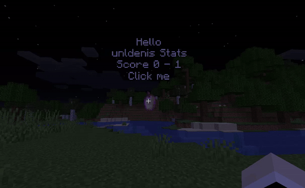

HoloEasy is a simple, modern and high-performant Java and Kotlin Minecraft Hologram library for 1.8-1.20.4 servers.

<p align="center">
  
</p>

## Quickstart

### Add dependency

> [!WARNING]
> Jitpack currently returns a 'Please Sign In first' error. You can find the build of the library on the release page.

Make sure you include the <a href="https://jitpack.io/">repository</a> as well.
#### Maven

```xml
<dependency>
    <groupId>com.github.unldenis</groupId>
    <artifactId>holoeasy</artifactId>
    <version>3.0.0</version>
</dependency>
```

#### Gradle

```kotlin
implementation("com.github.unldenis:holoeasy:3.0.0")
```

### Start programming (Java)

```java
import static org.holoeasy.builder.HologramBuilder.*;

// you can use a Pool or a org.bukkit.Plugin for HologramKey
IHologramPool pool = HoloEasy.startInteractivePool(plugin, 60, 0.5f, 5f);

public void addHologram(Location location) {
    hologram(new HologramKey(pool, "unique-id-holo"), location, () -> {
        textline("Hello");
        textline("{} Stats", Player::getName);
        textline("Score {} - {}", $ -> 0, $ -> 1);
        clickable("Click me").onClick(p -> {
            p.sendTitle(ChatColor.AQUA + "Hi", ChatColor.BOLD + "by HoloEasy",
                    20, 20, 20);
        });
        item(new ItemStack(Material.ENCHANTED_GOLDEN_APPLE));
    });
}
```

### Start programming (Kotlin)
```kotlin
import org.holoeasy.builder.HologramBuilder.*

// you can use a Pool or a org.bukkit.Plugin for HologramKey
val pool = startInteractivePool(plugin, 60.0, 0.5f, 5f)

fun addHologram(location: Location) {
    hologram(HologramKey(pool, "unique-id-holo"), location) {
        textline("Hello")
        textline("{} Stats", Player::getName)
        textline("Score {} - {}", { 0 }, { 1 })
        clickable("Click me").onClick {
            it.sendTitle(ChatColor.AQUA + "Hi", ChatColor.BOLD + "by HoloEasy",
                20, 20, 20)
        }
        item(ItemStack(Material.ENCHANTED_GOLDEN_APPLE))
    }
}
```


## Ex (Hologram-Lib)
Are you using a version older than 3.0.0? You can find the documentation <a href="https://unldenis.github.io/hologramlib/">here</a>